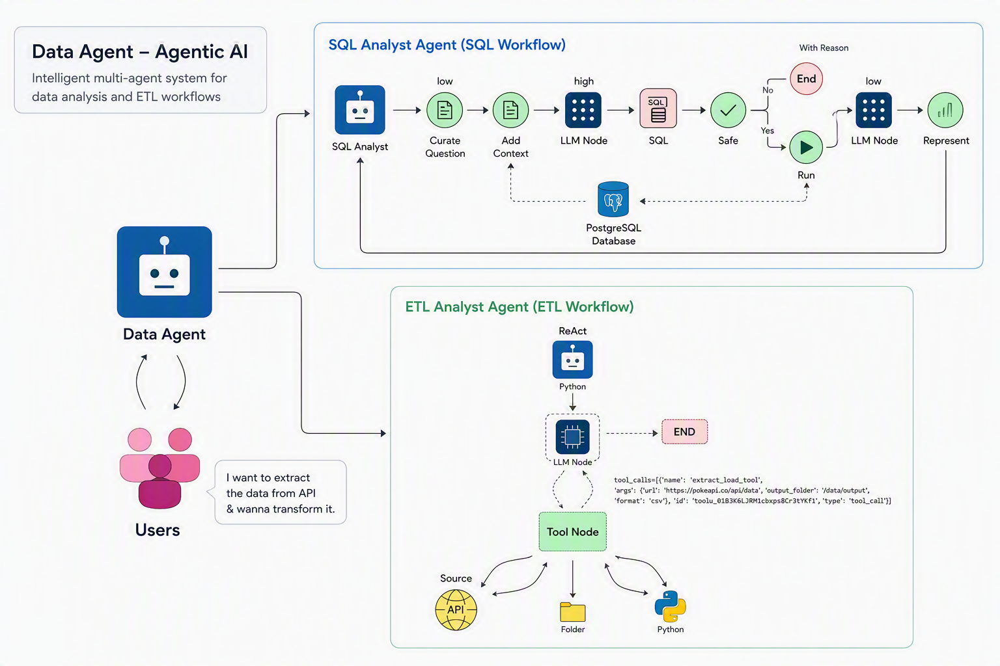
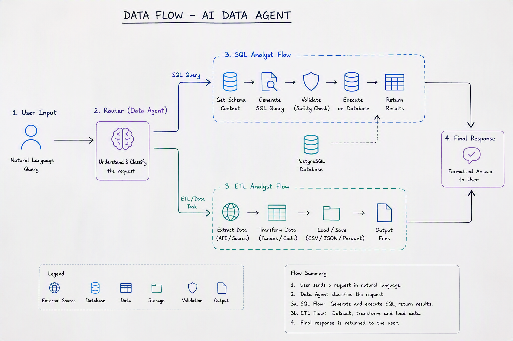
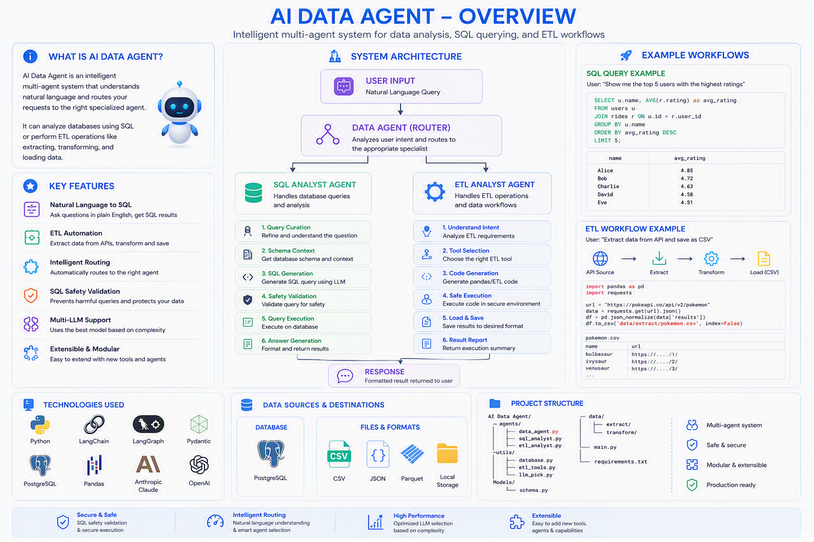

<div align="center">

# 🤖 AI Data Agent

### Système multi-agents intelligent pour l'analyse SQL et l'automatisation ETL

Un système moderne construit avec **LangGraph** qui comprend les demandes en langage naturel, classe automatiquement l'intention de l'utilisateur, et route la requête vers un agent spécialisé — SQL ou ETL — capable de l'exécuter en toute sécurité.


[Aperçu](#-vue-globale) •
[Fonctionnalités](#-fonctionnalités) •
[Architecture](#-architecture-détaillée) •
[Installation](#-installation) •
[Utilisation](#-utilisation) •
[Sécurité](#️-sécurité) •
[Roadmap](#️-roadmap)

</div>

---

## 📖 Table des matières

1. [Vue globale](#-vue-globale)
2. [Pourquoi ce projet](#-pourquoi-ce-projet)
3. [Fonctionnalités](#-fonctionnalités)
4. [Architecture détaillée](#-architecture-détaillée)
   - [Vue d'ensemble hiérarchique](#vue-densemble-hiérarchique)
   - [Data Agent (Router)](#1-data-agent-le-routeur-central)
   - [SQL Analyst Agent](#2-sql-analyst-agent)
   - [ETL Analyst Agent](#3-etl-analyst-agent)
   - [Flux d'état global (State Flow)](#flux-détat-global-state-flow)
5. [Pipeline de données](#-pipeline-de-données)
6. [Sécurité](#️-sécurité)
7. [Stack technique](#️-stack-technique)
8. [Structure du projet](#-structure-du-projet)
9. [Prérequis](#-prérequis)
10. [Installation](#-installation)
11. [Configuration](#️-configuration)
12. [Démarrage](#️-démarrage)
13. [Utilisation](#-utilisation)
14. [Modèles de données (Schemas Pydantic)](#-modèles-de-données-schemas-pydantic)
15. [Descriptions détaillées des agents](#-descriptions-détaillées-des-agents)
16. [Exemples d'utilisation](#-exemples-dutilisation)
17. [Sélection dynamique du LLM](#-sélection-dynamique-du-llm)
18. [Variables d'environnement](#-variables-denvironnement)
19. [Bonnes pratiques de développement](#️-développement)
20. [Tests](#-tests)
21. [Conteneurisation avec Docker](#-conteneurisation-avec-docker)
22. [Déploiement](#️-déploiement)
23. [Performance et optimisation](#-performance-et-optimisation)
24. [Dépannage (Troubleshooting)](#-dépannage-troubleshooting)
25. [FAQ](#-faq)
26. [Affichage des images sur GitHub](#️-affichage-des-images-sur-github)
27. [Roadmap](#️-roadmap)
28. [Contribuer](#-contribuer)
29. [Licence](#-licence)
30. [Auteur](#-auteur)

---

## 🌐 Vue globale



**AI Data Agent** transforme une demande utilisateur exprimée en langage naturel en une opération de données complète et sécurisée, sans que l'utilisateur ait besoin de connaître SQL, Pandas, ou l'architecture interne du système.

Le système :

1. **Analyse l'intention** de la demande (question analytique ou opération de données brutes) ;
2. **Sélectionne automatiquement** l'agent spécialisé le plus adapté ;
3. **Sécurise l'exécution** en validant chaque opération avant qu'elle ne touche la base de données ou le système de fichiers ;
4. **Retourne un résultat structuré**, prêt à être consommé par un humain ou par une autre application.

```text
Demande utilisateur (langage naturel)
            │
            ▼
   ┌────────────────────┐
   │  Data Agent · Router │
   └────────┬───────────┘
            │
   ┌────────┴─────────────┐
   │                       │
   ▼                       ▼
┌─────────────────┐   ┌──────────────────┐
│ SQL Analyst      │   │ ETL Analyst       │
│ Agent            │   │ Agent             │
└────────┬─────────┘   └─────────┬─────────┘
         │                       │
         ▼                       ▼
   PostgreSQL              API / Fichier
         │                       │
         ▼                       ▼
  Résultat analysé      CSV · JSON · Parquet
```

Ce README fusionne l'ensemble de la documentation du projet — vue d'ensemble, architecture technique, guides d'installation, exemples d'utilisation, sécurité, et feuille de route — en un seul document de référence exhaustif.

---

## 🎯 Pourquoi ce projet

La plupart des utilisateurs métier ne savent pas écrire de requêtes SQL, et la plupart des analystes perdent un temps considérable à écrire du code répétitif d'extraction ou de transformation de données. **AI Data Agent** répond à ce problème en offrant une interface unique en langage naturel :

- Un utilisateur métier peut poser une question analytique directement (*"Quel est le chiffre d'affaires moyen par type de véhicule ?"*) sans écrire une seule ligne de SQL.
- Un data engineer peut demander une extraction ou une transformation de données (*"Extrait les données de cette API et sauvegarde-les en Parquet"*) sans écrire de script Pandas à chaque fois.
- Le tout est **audité et sécurisé** : aucune commande destructive (`DELETE`, `DROP`, `TRUNCATE`, etc.) ne peut être exécutée sur la base de données, et le code généré dynamiquement est exécuté dans un environnement contrôlé.

Ce projet illustre des pratiques modernes d'ingénierie IA :

- Orchestration multi-agents avec **LangGraph**
- Routage intelligent basé sur la compréhension du langage naturel
- Validation de sécurité systématique avant toute exécution
- Architecture d'agents basée sur des outils (*tool-based agent architecture*)
- Sélection dynamique du LLM en fonction de la complexité de la tâche

---

## ✨ Fonctionnalités

### Capacités principales

| Fonctionnalité | Description |
|---|---|
| 🧭 **Routage intelligent** | Classe automatiquement chaque requête utilisateur comme `sql` ou `etl` |
| 🗣️ **Natural Language to SQL** | Transforme une question en langage naturel en requête SQL valide |
| 🧩 **Schema Awareness** | Récupère et utilise le schéma PostgreSQL réel pour générer des requêtes précises |
| 🛡️ **SQL Safety** | Bloque systématiquement les commandes destructives avant toute exécution |
| 🔄 **ETL Automation** | Extrait, transforme et sauvegarde des données automatiquement |
| 📦 **Multi-format Output** | Supporte l'export en CSV, JSON (Lines ou Records) et Parquet |
| 🧠 **Multi-LLM Support** | Adapte dynamiquement le modèle de langage à la complexité de la tâche |
| 🧱 **Architecture modulaire** | Facilite l'ajout de nouveaux agents, outils et sources de données |
| ✅ **Validation Pydantic** | Structure et valide chaque état interne des agents |
| 🔐 **Gestion des secrets** | Centralise les identifiants sensibles dans un fichier `.env` |

### Détail par domaine

**Agent d'analyse SQL :**
- Conversion langage naturel → requête SQL
- Récupération automatique du contexte de schéma
- Validation de sécurité des requêtes SQL (empêche les opérations destructives)
- Exécution de requêtes sur base de données PostgreSQL
- Raffinement intelligent des questions ambiguës

**Agent ETL :**
- Extraction de données depuis des API (JSON → formats structurés)
- Transformation de données avec Pandas
- Support multi-format (CSV, JSON, Parquet)
- Génération dynamique de code selon les besoins de l'utilisateur
- Exécution sécurisée du code généré

**Support Multi-LLM :**
- Requêtes de faible complexité : LLM rapide et économique
- Requêtes de complexité moyenne : LLM équilibré performance/coût
- Requêtes de haute complexité : LLM premium (Claude)

---

## 🧠 Architecture détaillée

Le projet repose sur une **architecture hiérarchique orchestrée avec LangGraph**, où un agent superviseur (le *Data Agent*) délègue le travail à des sous-agents spécialisés, chacun responsable d'un domaine précis (SQL ou ETL).



### Vue d'ensemble hiérarchique

```text
┌───────────────────────────────────────────────────────────────┐
│                     Data Agent (Router)                       │
│         Route les requêtes utilisateur vers le sous-agent     │
│                      approprié                                 │
└────────────────────────────┬───────────────────────────────────┘
                              │
                ┌─────────────┴─────────────┐
                │                           │
                ▼                           ▼
        ┌───────────────┐           ┌───────────────┐
        │  SQL Analyst   │           │  ETL Analyst   │
        │     Agent      │           │     Agent      │
        └───────┬────────┘           └───────┬────────┘
                │                            │
     ┌──────────┼──────────┐        ┌────────┼────────┐
     ▼          ▼          ▼        ▼        ▼         ▼
 Query      Schema      SQL      Extract  Transform  Code
 Curation   Context   Generation   Load      Load   Execution
     │          │          │        │        │         │
     ▼          ▼          ▼        ▼        ▼         ▼
 Safety     Query      Answer   Validation Sandboxed  Result
Validation Execution Generation           Execution  Reporting
```

### Le Data Agent : le routeur central

Le **Data Agent** constitue le point d'entrée unique du système. Il reçoit la demande brute de l'utilisateur en langage naturel et la classe dans l'une des deux catégories suivantes :

- `sql` — pour toute question liée à l'interrogation ou l'analyse de données déjà stockées en base ;
- `etl` — pour toute opération d'extraction, de transformation ou de chargement de données.

#### Composants du Data Agent

- **Router Node** : utilise une sortie structurée (`RouterSchema`, via Pydantic) pour classifier l'intention de la requête avec un haut niveau de confiance.
- **Conditional Routing** : bascule le graphe d'exécution vers le sous-graphe SQL ou ETL en fonction de la décision du router.
- **Graph Orchestration** : gère l'ensemble du cycle de vie de la requête via LangGraph, y compris la gestion de l'état partagé entre les nœuds.

#### Flux logique du Data Agent

```text
Entrée utilisateur (langage naturel)
        │
        ▼
┌───────────────────┐
│   Router Node      │  → Classifie : "sql" ou "etl"
└─────────┬──────────┘
          │
   ┌──────┴───────┐
   │  Condition    │
   │ route_response│
   └──────┬───────┘
   sql │       │ etl
       ▼       ▼
  SQL Agent   ETL Agent
       │       │
       └───┬───┘
           ▼
   Résultat agrégé
   retourné à l'utilisateur
```

### 1. SQL Analyst Agent

Le **SQL Analyst Agent** est responsable de l'ensemble du cycle de traitement des demandes analytiques adressées à la base de données PostgreSQL.


#### Workflow complet

```text
Question utilisateur
        ↓
① Reformulation (Query Curation)
        ↓
② Analyse du schéma (Schema Context)
        ↓
③ Construction du prompt (Prompt Query Context)
        ↓
④ Génération SQL (SQL Generation)
        ↓
⑤ Validation de sécurité (Safety Check)
        ↓
⑥ Exécution PostgreSQL (Query Execution)
        ↓
⑦ Réponse finale (Answer Generation)
```

#### Détail de chaque étape

1. **Query Curation** — Le LLM reformule la question brute de l'utilisateur pour lever toute ambiguïté (dates relatives, formulations imprécises, synonymes de colonnes, etc.) avant de poursuivre le traitement.
2. **Context Gathering** — Le système interroge PostgreSQL pour récupérer les métadonnées du schéma pertinent (tables, colonnes, types, clés étrangères).
3. **Prompt Construction** — Le contexte du schéma et la question reformulée sont assemblés dans un prompt détaillé destiné au LLM.
4. **SQL Generation** — Le LLM génère une requête SQL valide, syntaxiquement correcte et alignée sur le schéma réel de la base.
5. **Safety Check** — La requête générée est analysée pour détecter toute instruction destructive ou non autorisée (voir la section [Sécurité](#️-sécurité)).
6. **Query Execution** — Si la requête est jugée sûre, elle est exécutée sur PostgreSQL via Psycopg2 ; les résultats sont limités automatiquement à 10 lignes sauf indication contraire de l'utilisateur.
7. **Answer Generation** — Les résultats bruts de la requête sont reformulés par le LLM en une réponse claire, structurée et directement compréhensible.

#### Fonctionnalités de sécurité du SQL Analyst

- Empêche l'exécution de commandes dangereuses (`INSERT`, `UPDATE`, `DELETE`, `DROP`, `ALTER`)
- Valide la requête avant toute exécution réelle
- Limite automatiquement les résultats à 10 lignes (sauf demande explicite contraire)
- Valide le schéma utilisé par rapport au schéma réel de la base de données

### 2. ETL Analyst Agent

Le **ETL Analyst Agent** prend en charge l'ensemble des workflows liés aux données : extraction depuis des sources externes, transformation, et chargement vers différents formats de sortie.

#### Workflow complet

```text
Source (API ou fichier local)
        ↓
① Extraction (Extract)
        ↓
② Transformation avec Pandas (Transform)
        ↓
③ Validation et exécution sécurisée (Validate & Execute)
        ↓
④ Export (Load) — CSV, JSON ou Parquet
```

#### Détail de chaque étape

1. **Tool Binding** — Les outils ETL disponibles (`extract_load_tool`, `transform_load_tool`) sont attachés dynamiquement au LLM.
2. **User Intent Understanding** — Le LLM analyse la demande pour comprendre précisément l'opération de transformation ou d'extraction souhaitée.
3. **Tool Selection** — Le LLM choisit l'outil ETL le plus adapté à la tâche demandée.
4. **Code Generation** — Du code Pandas est généré dynamiquement pour réaliser la transformation demandée.
5. **Safe Execution** — Le code généré est exécuté dans un environnement contrôlé (sandbox), avec gestion des erreurs et validation des entrées.
6. **Result Reporting** — Le statut d'exécution ainsi que le code généré sont retournés à l'utilisateur pour transparence et traçabilité.

#### Outils ETL supportés

| Outil | Rôle |
|---|---|
| `extract_load_tool` | Extraction depuis une API → chargement vers le stockage local |
| `transform_load_tool` | Transformation de données via Pandas → chargement du résultat |

#### Formats supportés

- **CSV** (format par défaut)
- **JSON** (mode *Lines* ou *Records*)
- **Parquet**

### Flux d'état global (State Flow)

```text
1. User Input      → Requête en langage naturel
2. Router Node     → Classifie la requête comme "sql" ou "etl"
3. Agent Dispatch  → Route vers le sous-agent approprié
4. Processing      → Chaque agent traite sa portion de la tâche
5. Output          → Retourne un résultat structuré à l'utilisateur
```

L'état est partagé et propagé entre les nœuds du graphe LangGraph à l'aide de schémas Pydantic strictement typés (voir [Modèles de données](#-modèles-de-données-schemas-pydantic)), garantissant la cohérence des données tout au long du pipeline.

---

## 🔄 Pipeline de données

Le schéma ci-dessous illustre le pipeline complet de traitement d'une requête, depuis la saisie utilisateur jusqu'au résultat final, en passant par les étapes de validation et d'exécution.



Ce pipeline met en évidence plusieurs points critiques :

- **Point de décision unique** : toute requête passe obligatoirement par le Router avant d'être traitée, garantissant une classification cohérente.
- **Double couche de sécurité** : la validation de sécurité SQL et l'exécution sandboxée du code ETL constituent deux gardes-fous indépendants avant toute action irréversible.
- **Traçabilité complète** : chaque étape du pipeline enrichit l'état partagé (messages, requêtes générées, résultats intermédiaires), ce qui permet de reconstituer entièrement le raisonnement de l'agent a posteriori.
- **Boucle de correction implicite** : en cas d'échec de la validation de sécurité, le système peut interrompre le traitement plutôt que de forcer une exécution non sécurisée.

---

## 🛡️ Sécurité

La sécurité est un pilier central de la conception de ce projet, à la fois côté base de données et côté exécution de code.

### Validation SQL

Chaque requête SQL générée par le LLM est systématiquement contrôlée avant son exécution. Le système refuse notamment les instructions suivantes :

```sql
INSERT
UPDATE
DELETE
DROP
ALTER
TRUNCATE
CREATE
GRANT
REVOKE
```

Les opérations SQL autorisées sont **strictement limitées à la lecture et à l'analyse des données** (`SELECT` et opérations en lecture seule). Toute tentative de modification de la structure ou du contenu de la base de données est bloquée avant exécution, et un message explicite est renvoyé à l'utilisateur (*"SQL query unsafe"*).

### Exécution sécurisée du code ETL

- Le code Pandas généré dynamiquement est exécuté dans un **environnement contrôlé (sandbox)**.
- Les entrées sont validées avant traitement.
- Les erreurs sont capturées et remontées de manière structurée, sans exposer de détails d'implémentation sensibles.

### Protection des secrets

Les identifiants de connexion (base de données, clés API des fournisseurs LLM) sont systématiquement stockés dans un fichier `.env`, **jamais directement dans le code source**. Ce fichier doit impérativement être exclu du contrôle de version via `.gitignore`.

```gitignore
.env
.venv/
__pycache__/
*.py[cod]
data/extract/*
data/transform/*
!.gitkeep
```

> ⚠️ **Avertissement de production** : avant toute utilisation en production, toute exécution de code généré par un LLM doit être isolée dans un environnement sécurisé, avec des permissions minimales (principe du moindre privilège), idéalement dans un conteneur dédié et éphémère.

### Checklist de sécurité recommandée avant mise en production

- [ ] Exécuter le code ETL généré dans un conteneur isolé (sans accès réseau non nécessaire)
- [ ] Utiliser un utilisateur PostgreSQL en lecture seule dédié au SQL Analyst Agent
- [ ] Mettre en place une limite de temps d'exécution (*timeout*) sur chaque requête générée
- [ ] Journaliser (logger) chaque requête SQL générée et chaque code ETL exécuté, avec horodatage
- [ ] Mettre en place une whitelist explicite de tables/colonnes accessibles si nécessaire
- [ ] Ne jamais exposer les messages d'erreur bruts de la base de données à l'utilisateur final
- [ ] Faire une revue régulière des logs d'exécution pour détecter des tentatives suspectes

---

## 🛠️ Stack technique

| Technologie | Rôle dans le projet |
|---|---|
| **Python 3.12+** | Langage principal du projet |
| **LangGraph** | Orchestration multi-agents, gestion de l'état et du routage conditionnel |
| **LangChain** | Abstraction des modèles de langage, messages, et outils (*tools*) |
| **PostgreSQL** | Base de données analytique cible du SQL Analyst Agent |
| **Psycopg2** | Driver de connexion Python vers PostgreSQL |
| **Pandas** | Moteur de transformation de données pour l'ETL Analyst Agent |
| **Pydantic** | Validation stricte des états internes et des sorties structurées des LLM |
| **OpenAI / Claude (Anthropic)** | Fournisseurs de modèles de langage utilisés selon la complexité de la tâche |
| **python-dotenv** | Gestion sécurisée de la configuration via variables d'environnement |

---

## 📁 Structure du projet

```text
AI Data Agent/
├── agents/                          # Implémentations des agents
│   ├── __init__.py
│   ├── data_agent.py                # Agent routeur principal
│   ├── sql_analyst.py               # Agent d'analyse SQL
│   └── etl_analyst.py               # Agent d'opérations ETL
│
├── Models/                          # Modèles de données
│   ├── __init__.py
│   └── schema.py                    # Schémas Pydantic pour la gestion d'état
│
├── utils/                           # Modules utilitaires
│   ├── __init__.py
│   ├── database.py                  # Utilitaires PostgreSQL
│   ├── etl_tools.py                 # Boîte à outils ETL
│   └── llm_pick.py                  # Logique de sélection du LLM
│
├── data/                            # Répertoire de données
│   ├── extract/                     # Stockage des données extraites
│   ├── transform/                   # Stockage des données transformées
│   ├── payments.csv                 # Jeu de données d'exemple
│   ├── ratings.csv                  # Jeu de données d'exemple
│   ├── rides.csv                    # Jeu de données d'exemple
│   ├── users.csv                    # Jeu de données d'exemple
│   └── vehicles.csv                 # Jeu de données d'exemple
│
├── OverView.png                     # Illustration : vue d'ensemble
├── Designer.png                     # Illustration : architecture
├── pepline.png                      # Illustration : pipeline de données
├── sql_analyst_graph.png            # Illustration : graphe SQL Analyst
├── main.py                          # Point d'entrée principal
├── feed_db.py                       # Script d'initialisation de la base de données
├── pyproject.toml                   # Métadonnées et dépendances du projet
├── requirements.txt                 # Dépendances Python (pip)
├── .env                             # Variables d'environnement (non versionné)
├── .gitignore                       # Fichiers exclus du contrôle de version
└── README.md                        # Ce fichier
```

---

## 📦 Prérequis

Avant de commencer, assure-toi de disposer des éléments suivants :

- **Python 3.12+** installé sur ta machine
- Une instance **PostgreSQL** accessible (locale ou distante), pour les opérations SQL
- Des **clés API** valides pour au moins un fournisseur de LLM (Claude et/ou OpenAI)
- Un **environnement virtuel Python** (fortement recommandé pour isoler les dépendances)
- (Optionnel) **Docker** si tu souhaites conteneuriser le projet

---

## 🚀 Installation

### 1. Ouvrir / cloner le projet

Si tu pars du projet local :

```powershell
cd "C:\Users\amine\OneDrive\Documents\AI Data Agent"
```

Si tu clones depuis GitHub :

```bash
git clone https://github.com/amine-LabsCraft/AI-Data-Agent.git
cd AI-Data-Agent
```

### 2. Créer l'environnement virtuel

```bash
python -m venv .venv
```

### 3. Activer l'environnement

**Windows PowerShell**

```powershell
.\.venv\Scripts\Activate.ps1
```

**macOS / Linux**

```bash
source .venv/bin/activate
```

### 4. Installer les dépendances

Avec `pip` classique :

```bash
pip install -r requirements.txt
```

Avec `uv` (plus rapide) :

```bash
uv pip install -r requirements.txt
```

Ou directement via `pyproject.toml` :

```bash
pip install -e .
```

Cette installation apporte notamment :

- `langchain` — Framework LLM principal
- `langgraph` — Orchestration multi-agents
- `langchain-anthropic` — Intégration Claude
- `langchain-openai` — Intégration OpenAI
- `pandas` — Traitement de données
- `psycopg2` — Driver PostgreSQL
- `pydantic` — Validation de données
- `python-dotenv` — Configuration d'environnement

---

## ⚙️ Configuration

### Fichier `.env`

Crée un fichier `.env` à la racine du projet avec le contenu suivant :

```env
# ==== Fournisseurs LLM ====
OPENAI_API_KEY=your_openai_api_key
ANTHROPIC_API_KEY=your_anthropic_api_key

# ==== Base de données PostgreSQL ====
host=localhost
port=5432
user=postgres
password=your_password
database=data_agent_db

# ==== Sélection optionnelle des modèles ====
LLM_MODEL_LOW=gpt-3.5-turbo
LLM_MODEL_MEDIUM=gpt-4-turbo
LLM_MODEL_HIGH=claude-3-opus
```

### Fichier `.gitignore`

Ajoute les fichiers sensibles et temporaires suivants dans `.gitignore` :

```gitignore
.env
.venv/
__pycache__/
*.py[cod]
data/extract/*
data/transform/*
!.gitkeep
```

### Configuration de la base de données (`utils/database.py`)

```python
from utils.database import DatabaseUtil

conn_details = {
    "host": "localhost",
    "port": 5432,
    "user": "postgres",
    "password": "password",
    "dbname": "data_agent_db"
}

db = DatabaseUtil(conn_details)
schema_info = db.schema_details("public")
```

---

## ▶️ Démarrage

### Initialiser la base de données

```bash
python feed_db.py
```

Ce script initialise la base de données avec les jeux de données d'exemple présents dans `data/` (`payments.csv`, `ratings.csv`, `rides.csv`, `users.csv`, `vehicles.csv`).

### Lancer le Data Agent (mode complet)

```bash
python main.py
```

### Lancer un agent de manière isolée

```bash
python agents/sql_analyst.py
```

```bash
python agents/etl_analyst.py
```

Ce mode est particulièrement utile pour déboguer ou tester un agent spécifique indépendamment du routeur principal.

---

## 💻 Utilisation

### Utilisation en Python

```python
from agents.data_agent import data_agent
from langchain_core.messages import HumanMessage

response = data_agent.invoke({
    "messages": [
        HumanMessage(
            content="Show me the top 5 users with the highest ratings"
        )
    ],
    "route_response": ""
})

print(response)
```

### Exemple : extraction depuis une API

```python
from agents.data_agent import data_agent
from langchain_core.messages import HumanMessage

response = data_agent.invoke({
    "messages": [
        HumanMessage(content="""
            I want to extract the data from the API endpoint
            'https://pokeapi.co/api/v2/pokemon' and save it to
            data/extract folder in CSV format
        """)
    ],
    "route_response": ""
})

print(response)
```

### Exemple : transformation d'un fichier existant

```python
from agents.data_agent import data_agent
from langchain_core.messages import HumanMessage

response = data_agent.invoke({
    "messages": [
        HumanMessage(content="""
            Transform the rides.csv data by filtering only rides
            with rating > 4.5 and save to data/transform
        """)
    ],
    "route_response": ""
})

print(response)
```

### Lancement depuis la ligne de commande

```bash
# Lancer l'agent principal
python main.py

# Lancer les agents individuellement
python agents/sql_analyst.py
python agents/etl_analyst.py
```

---

## 📊 Modèles de données (Schemas Pydantic)

Le projet s'appuie fortement sur **Pydantic** pour garantir la validité et la cohérence de l'état échangé entre les nœuds du graphe LangGraph.

### `DataAgentSchema` — État de l'agent principal

```python
class DataAgentSchema(BaseModel):
    messages: List                    # Ensemble des messages de la conversation
    route_response: str                # Décision du router ("sql" ou "etl")
```

### `RouterSchema` — Classification de la requête

```python
class RouterSchema(BaseModel):
    answer: Literal["sql", "etl"]      # Classification de la requête
    comments: str                       # Justification du raisonnement de classification
```

### `AgentSchema` — État du SQL Analyst Agent

```python
class AgentSchema(BaseModel):
    messages: List                          # Messages de la conversation
    user_question: str                      # Question originale de l'utilisateur
    curated_ques: str                       # Question reformulée / clarifiée
    prompt_query_context: str               # Contexte base de données + prompt assemblé
    generated_sql_query: str                # Requête SQL générée
    is_safe: Literal["Yes", "No"]           # Résultat de la validation de sécurité
    comments: str                           # Commentaires du contrôle de sécurité
    sql_query_execution_result: str         # Résultat brut de l'exécution de la requête
    final_answer: str                       # Réponse finale formatée pour l'utilisateur
```

### `ETLAgentSchema` — État de l'ETL Analyst Agent

```python
class ETLAgentSchema(BaseModel):
    messages: List                          # Messages de la conversation
```

Ces schémas garantissent que chaque nœud du graphe reçoit et produit un état parfaitement typé, ce qui limite fortement les erreurs silencieuses lors de l'orchestration multi-agents.

---

## 🤖 Descriptions détaillées des agents

### 1. Data Agent (routeur principal)

**Fichier** : `agents/data_agent.py`

**Responsabilités :**
- Recevoir les requêtes utilisateur en langage naturel
- Classifier chaque requête comme opération `sql` ou `etl`
- Router la requête vers le sous-agent approprié
- Agréger les résultats et les retourner à l'utilisateur

**Composants clés :**
- **Router Node** : utilise une sortie structurée pour classifier l'intention de la requête
- **Conditional Routing** : route vers l'agent SQL ou ETL selon la classification
- **Graph Orchestration** : gère le workflow complet via LangGraph

### 2. SQL Analyst Agent


**Fichier** : `agents/sql_analyst.py`

**Responsabilités :**
- Convertir des requêtes en langage naturel en SQL
- Gérer l'ensemble des opérations de requêtage de la base de données
- Valider la sécurité des requêtes générées
- Exécuter les requêtes et retourner les résultats formatés

**Workflow (rappel) :**
1. Query Curation — Raffine la question de l'utilisateur pour plus de clarté
2. Context Gathering — Récupère les détails du schéma de la base de données
3. Prompt Construction — Crée un contexte détaillé pour le LLM
4. SQL Generation — Génère la requête SQL via le LLM
5. Safety Check — Valide la sécurité de la requête
6. Query Execution — Exécute la requête validée sur la base de données
7. Answer Generation — Formate et retourne les résultats

### 3. ETL Analyst Agent


**Fichier** : `agents/etl_analyst.py`

**Responsabilités :**
- Gérer l'extraction de données depuis des API
- Effectuer des transformations de données avec Pandas
- Gérer le chargement des données vers différents formats
- Exécuter le code de façon sécurisée dans un environnement contrôlé

**Workflow (rappel) :**
1. Tool Binding — Attache les outils ETL au LLM
2. User Intent Understanding — Analyse les besoins de transformation
3. Tool Selection — Choisit l'opération ETL appropriée
4. Code Generation — Génère du code Pandas pour la transformation
5. Safe Execution — Exécute le code généré dans un environnement sandboxé
6. Result Reporting — Retourne le statut d'exécution et le code généré

---

## 📚 Exemples d'utilisation

### Exemple 1 — Analyse SQL simple

**Demande utilisateur :**

```text
Show me the top 5 users with the highest ratings.
```

**Traitement interne :**

```text
Router → SQL Analyst → Schema Context → SQL Generation
       → Safety Check → PostgreSQL → Final Answer
```

**Étapes détaillées :**
1. Le router classifie la requête comme `sql`
2. Le SQL Agent récupère le schéma de la table `users` / `ratings`
3. Il génère : `SELECT user_id, AVG(rating) AS avg_rating FROM ratings GROUP BY user_id ORDER BY avg_rating DESC LIMIT 5`
4. La validation de sécurité confirme que la requête est en lecture seule ✓
5. La requête est exécutée et les résultats sont formatés en réponse finale

### Exemple 2 — Requête analytique avec agrégation

**Demande utilisateur :**

```text
Show me the average rating for each vehicle type.
```

**Traitement interne :**
1. Router classifie comme requête SQL
2. SQL Agent récupère le schéma de la table `rides` / `vehicles`
3. Génère : `SELECT vehicle_type, AVG(rating) FROM rides GROUP BY vehicle_type LIMIT 10`
4. Valide la sécurité ✓
5. Exécute et retourne les résultats

### Exemple 3 — Extraction depuis une API

**Demande utilisateur :**

```text
Extract data from https://pokeapi.co/api/v2/pokemon
and save it as a CSV file in data/extract.
```

**Traitement interne :**

```text
Router → ETL Analyst → API Extraction → JSON Normalization
       → CSV Export
```

**Étapes détaillées :**
1. Router classifie comme requête `etl`
2. L'ETL Agent sélectionne `extract_load_tool`
3. Une requête HTTP est effectuée vers l'endpoint spécifié
4. La réponse JSON est normalisée en structure tabulaire
5. Le résultat est sauvegardé dans `data/extract/extracted_data.csv`

### Exemple 4 — Transformation d'un fichier local

**Demande utilisateur :**

```text
Filter rides.csv to keep only rows with a rating greater than 4.5
and save the result as JSON.
```

**Traitement interne :**

```text
Router → ETL Analyst → Pandas Transformation → Validation
       → JSON Export
```

**Étapes détaillées :**
1. Router classifie comme requête `etl`
2. L'ETL Agent analyse la demande de transformation
3. Génère du code Pandas pour filtrer `rides.csv` (`rating > 4.5`)
4. Exécute le code de façon sécurisée
5. Sauvegarde le résultat dans `data/transform/` au format JSON

---

## 🎛️ Sélection dynamique du LLM

Le module `utils/llm_pick.py` contient la fonction `pick_llm()`, qui sélectionne intelligemment le modèle de langage le plus adapté en fonction de la complexité de la tâche à accomplir.

```python
from utils.llm_pick import pick_llm

# Sélection basée sur la complexité
llm_fast = pick_llm("low")         # Modèle rapide et économique pour les requêtes simples
llm_balanced = pick_llm("medium")  # Modèle équilibré performance/coût
llm_powerful = pick_llm("high")    # Modèle premium pour les tâches complexes (Claude)
```

### Logique de sélection recommandée

| Niveau de complexité | Cas d'usage typique | Modèle recommandé |
|---|---|---|
| **Low** | Reformulation simple, classification de routage | `gpt-3.5-turbo` |
| **Medium** | Génération de requêtes SQL standards, transformations Pandas simples | `gpt-4-turbo` |
| **High** | Raisonnement complexe multi-étapes, génération de code ETL avancé | `claude-3-opus` |

Cette approche permet d'**optimiser le coût global** du système en réservant les modèles les plus puissants (et les plus coûteux) aux tâches qui en ont réellement besoin.

---

## 📝 Variables d'environnement

| Variable | Description | Exemple |
|---|---|---|
| `ANTHROPIC_API_KEY` | Clé API Claude (Anthropic) | `sk-ant-...` |
| `OPENAI_API_KEY` | Clé API OpenAI | `sk-...` |
| `host` | Hôte PostgreSQL | `localhost` |
| `port` | Port PostgreSQL | `5432` |
| `user` | Utilisateur PostgreSQL | `postgres` |
| `password` | Mot de passe PostgreSQL | `your_password` |
| `database` | Nom de la base de données | `data_agent_db` |
| `LLM_MODEL_LOW` | Modèle utilisé pour les tâches simples | `gpt-3.5-turbo` |
| `LLM_MODEL_MEDIUM` | Modèle utilisé pour les tâches moyennes | `gpt-4-turbo` |
| `LLM_MODEL_HIGH` | Modèle utilisé pour les tâches complexes | `claude-3-opus` |

---

## 🛠️ Développement

### Ajouter un nouvel agent

1. Créer un nouveau fichier d'agent dans le répertoire `agents/`
2. Définir le schéma d'état correspondant dans `Models/schema.py`
3. Implémenter les nœuds de l'agent avec LangGraph
4. Ajouter la logique de routage correspondante dans `data_agent.py`
5. Mettre à jour la documentation (ce README notamment)

**Exemple de squelette pour un nouvel agent :**

```python
from langgraph.graph import StateGraph, END
from Models.schema import MyNewAgentSchema

def my_node(state: MyNewAgentSchema) -> MyNewAgentSchema:
    # Logique du nœud
    return state

graph = StateGraph(MyNewAgentSchema)
graph.add_node("my_node", my_node)
graph.set_entry_point("my_node")
graph.add_edge("my_node", END)

my_new_agent = graph.compile()
```

### Étendre les outils ETL

Ajoute de nouveaux outils dans `utils/etl_tools.py` :

```python
from langchain_core.tools import tool

@tool
def new_tool(param: str) -> str:
    """Description claire de l'outil, utilisée par le LLM pour décider quand l'invoquer."""
    # Implémentation
    pass
```

### Personnaliser la sélection du LLM

Modifie `utils/llm_pick.py` pour ajuster :
- Les critères de sélection du modèle
- La température et les autres hyperparamètres
- Les limites de tokens
- Le format de réponse attendu

### Conventions de code recommandées

- Respecter le style de code existant (formatage, nommage des variables et des fonctions)
- Documenter chaque nouvel agent avec des docstrings claires
- Toute nouvelle fonctionnalité doit s'accompagner d'un schéma d'état Pydantic
- Réfléchir systématiquement aux implications de sécurité de tout nouveau nœud exécutant du code ou des requêtes SQL
- Ajouter des tests pour toute nouvelle fonctionnalité

---

## 🧪 Tests

Le projet ne dispose pas encore d'une suite de tests automatisés complète (voir [Roadmap](#️-roadmap)), mais voici une structure recommandée pour démarrer :

```text
tests/
├── unit/
│   ├── test_router.py
│   ├── test_sql_safety.py
│   ├── test_llm_pick.py
│   └── test_etl_tools.py
├── integration/
│   ├── test_sql_analyst_flow.py
│   └── test_etl_analyst_flow.py
└── conftest.py
```

### Exemple de test unitaire — validation de sécurité SQL

```python
import pytest
from utils.database import is_query_safe

@pytest.mark.parametrize("query,expected", [
    ("SELECT * FROM users LIMIT 10", True),
    ("DELETE FROM users", False),
    ("DROP TABLE payments", False),
    ("UPDATE rides SET rating = 5", False),
    ("SELECT AVG(rating) FROM rides GROUP BY vehicle_type", True),
])
def test_sql_safety(query, expected):
    assert is_query_safe(query) == expected
```

### Exemple de test d'intégration — flux ETL complet

```python
import os
import pandas as pd
from agents.data_agent import data_agent
from langchain_core.messages import HumanMessage

def test_etl_transform_flow(tmp_path):
    response = data_agent.invoke({
        "messages": [
            HumanMessage(content="Filter rides.csv where rating > 4.5 and save as JSON")
        ],
        "route_response": ""
    })
    assert response is not None
    output_path = "data/transform/rides_filtered.json"
    assert os.path.exists(output_path)
```

### Recommandations

- Utiliser `pytest` comme framework de test principal
- Mocker les appels aux LLM (OpenAI/Claude) pour des tests rapides et déterministes
- Utiliser une base de données PostgreSQL de test isolée (ou `pytest-postgresql`) pour les tests d'intégration SQL
- Mesurer la couverture de code avec `pytest-cov`

```bash
pip install pytest pytest-cov pytest-postgresql
pytest --cov=agents --cov=utils tests/
```

---

## 🐳 Conteneurisation avec Docker

Bien que la conteneurisation ne soit pas encore implémentée dans le projet (voir [Roadmap](#️-roadmap)), voici une proposition de configuration Docker pour faciliter le déploiement futur.

### `Dockerfile` proposé

```dockerfile
FROM python:3.12-slim

WORKDIR /app

COPY requirements.txt .
RUN pip install --no-cache-dir -r requirements.txt

COPY . .

ENV PYTHONUNBUFFERED=1

CMD ["python", "main.py"]
```

### `docker-compose.yml` proposé

```yaml
version: "3.9"

services:
  ai-data-agent:
    build: .
    container_name: ai-data-agent
    env_file:
      - .env
    depends_on:
      - postgres
    volumes:
      - ./data:/app/data
    networks:
      - agent-network

  postgres:
    image: postgres:16
    container_name: ai-data-agent-db
    restart: unless-stopped
    environment:
      POSTGRES_USER: ${user}
      POSTGRES_PASSWORD: ${password}
      POSTGRES_DB: ${database}
    ports:
      - "5432:5432"
    volumes:
      - pgdata:/var/lib/postgresql/data
    networks:
      - agent-network

volumes:
  pgdata:

networks:
  agent-network:
    driver: bridge
```

### Lancement avec Docker Compose

```bash
docker compose up --build
```

> 💡 Pour un usage en production, il est recommandé d'exécuter le code ETL généré dynamiquement dans un **conteneur séparé et éphémère**, distinct du conteneur principal de l'application, afin de limiter la surface d'attaque en cas d'exécution de code non prévu.

---

## ☁️ Déploiement

Quelques pistes pour un déploiement en environnement cloud (à affiner selon le fournisseur choisi — voir [Roadmap](#️-roadmap)) :

- **Base de données** : utiliser un service PostgreSQL managé (Amazon RDS, Google Cloud SQL, Azure Database for PostgreSQL) plutôt qu'une instance auto-hébergée.
- **Application** : déployer le conteneur Docker sur un service comme AWS ECS/Fargate, Google Cloud Run, ou Azure Container Apps.
- **Secrets** : utiliser un gestionnaire de secrets managé (AWS Secrets Manager, Google Secret Manager, Azure Key Vault) plutôt qu'un simple fichier `.env` en production.
- **Observabilité** : intégrer un système de logs centralisé (CloudWatch, Stackdriver, Datadog) pour suivre l'exécution des agents en production.
- **Isolation d'exécution** : exécuter le code ETL généré dynamiquement dans une fonction serverless isolée (AWS Lambda, Google Cloud Functions) avec des permissions IAM minimales.

---

## 📈 Performance et optimisation

- **Complexité des requêtes** : les requêtes de faible complexité utilisent des LLM plus rapides, réduisant la latence globale
- **Optimisation de la base de données** : ajouter des index sur les colonnes fréquemment interrogées améliore significativement les temps de réponse du SQL Analyst Agent
- **Limitation du débit des API** : respecter les limites de débit (*rate limits*) des API externes utilisées lors des opérations d'extraction
- **Utilisation mémoire** : les transformations sur de larges jeux de données peuvent nécessiter des optimisations spécifiques (traitement par lots, `chunksize` dans Pandas, etc.)
- **Mise en cache** : envisager la mise en cache du schéma de la base de données pour éviter de le re-récupérer à chaque requête SQL
- **Parallélisation** : pour de gros volumes ETL, envisager une exécution parallèle des transformations indépendantes

---

## 🚨 Dépannage (Troubleshooting)

### Erreur : "Database connection failed"

**Cause probable :** PostgreSQL n'est pas démarré, ou les identifiants dans `.env` sont incorrects.

**Solution :**
- Vérifier que le service PostgreSQL est bien actif
- Vérifier que `host`, `port`, `user`, `password` et `database` correspondent à ta configuration réelle
- Tester la connexion manuellement avec `psql` ou un client PostgreSQL

### Erreur : "API key not found"

**Cause probable :** Les clés API des fournisseurs LLM ne sont pas correctement définies.

**Solution :**
- Vérifier que le fichier `.env` existe bien à la racine du projet
- Vérifier que `ANTHROPIC_API_KEY` et/ou `OPENAI_API_KEY` sont bien renseignées
- S'assurer que `python-dotenv` charge correctement le fichier `.env` au démarrage

### Erreur : "SQL query unsafe"

**Cause probable :** La requête générée contient une opération destructive.

**Solution :**
- Reformuler la demande pour qu'elle corresponde à une opération de lecture seule (`SELECT`)
- Vérifier que la question ne demande pas explicitement une modification de données

### Erreur : "Module not found"

**Cause probable :** L'environnement virtuel n'est pas activé, ou les dépendances ne sont pas installées.

**Solution :**
- Activer l'environnement virtuel (`.\.venv\Scripts\Activate.ps1` sous Windows, `source .venv/bin/activate` sous macOS/Linux)
- Réinstaller les dépendances avec `pip install -r requirements.txt`

### Erreur : "Schema not found" ou schéma incomplet

**Cause probable :** La base de données n'a pas été initialisée avec `feed_db.py`, ou le schéma cible diffère de `"public"`.

**Solution :**
- Exécuter `python feed_db.py` avant tout usage du SQL Analyst Agent
- Vérifier le nom du schéma passé à `db.schema_details(...)`

### Erreur : Extraction API échouée

**Cause probable :** L'endpoint API est inaccessible, ou la réponse ne correspond pas au format JSON attendu.

**Solution :**
- Vérifier manuellement l'accessibilité de l'endpoint (par exemple avec `curl` ou un navigateur)
- Vérifier les éventuelles limites de débit (*rate limiting*) imposées par l'API cible

---

## ❓ FAQ

**Le système peut-il fonctionner sans base de données PostgreSQL ?**
Non pour les opérations SQL — PostgreSQL est requis pour le SQL Analyst Agent. En revanche, l'ETL Analyst Agent peut fonctionner indépendamment, sur des fichiers ou des API, sans base de données.

**Puis-je utiliser uniquement OpenAI, sans clé Claude ?**
Oui, à condition d'ajuster `utils/llm_pick.py` pour ne pointer que vers des modèles OpenAI. Le projet est conçu pour être agnostique du fournisseur de LLM.

**Le système peut-il halluciner une requête SQL incorrecte ?**
C'est un risque inhérent à tout système basé sur un LLM. La validation de sécurité empêche les opérations destructives, mais elle ne garantit pas la pertinence sémantique à 100 % de chaque requête générée — une vérification humaine reste recommandée sur des cas critiques.

**Comment ajouter une nouvelle source de données pour l'ETL ?**
Ajoute un nouvel outil dans `utils/etl_tools.py` (voir [Étendre les outils ETL](#étendre-les-outils-etl)), puis assure-toi qu'il est correctement décrit pour que le LLM puisse le sélectionner à bon escient.

**Le projet gère-t-il la mémoire conversationnelle entre plusieurs requêtes ?**
Pas encore de façon persistante — c'est un point identifié dans la [Roadmap](#️-roadmap).

---

## 🖼️ Affichage des images sur GitHub

Pour afficher correctement les illustrations sur GitHub, place les fichiers image suivants **à la racine du dépôt**, au même niveau que ce `README.md` :

```text
AI Data Agent/
├── README.md
├── OverView.png
├── Designer.png
├── pepline.png
└── sql_analyst_graph.png
```

Les chemins Windows locaux comme `C:\Users\amine\OneDrive\Documents\AI Data Agent\OverView.png` ne fonctionnent pas sur GitHub — seuls les chemins relatifs sont valides une fois le dépôt publié. Ce README utilise donc exclusivement des chemins relatifs :

```markdown


```

> 📌 Avant de pousser (`git push`) le projet, copie manuellement les 4 fichiers PNG depuis ton dossier local vers la racine du dépôt Git, puis vérifie leur affichage dans l'aperçu du fichier `README.md` sur GitHub.

---

## 🗺️ Roadmap

- [ ] Ajouter une suite de tests unitaires et d'intégration complète
- [ ] Ajouter une mémoire conversationnelle persistante entre les sessions
- [ ] Renforcer l'isolation du code ETL généré (sandbox dédiée, conteneur éphémère)
- [ ] Ajouter le suivi et l'observabilité des agents (logging structuré, traces LangSmith)
- [ ] Créer une interface utilisateur (web ou desktop) au-dessus du système d'agents
- [ ] Conteneuriser le projet avec Docker (voir [proposition ci-dessus](#-conteneurisation-avec-docker))
- [ ] Ajouter de nouvelles sources de données (autres bases de données, fichiers Excel, autres API)
- [ ] Préparer un déploiement cloud complet (voir [Déploiement](#️-déploiement))
- [ ] Ajouter un système de cache pour le contexte de schéma PostgreSQL
- [ ] Ajouter une authentification et une gestion multi-utilisateurs
- [ ] Documenter des benchmarks de performance comparant les différents niveaux de LLM

---

## 🤝 Contribuer

Les contributions sont les bienvenues ! Merci de veiller à respecter les points suivants :

- Le code respecte le style existant du projet
- Chaque agent est correctement documenté (docstrings, commentaires pertinents)
- Toute nouvelle fonctionnalité s'accompagne d'un schéma d'état Pydantic adapté
- Les implications de sécurité de toute modification touchant l'exécution SQL ou ETL sont explicitement considérées
- Des tests sont ajoutés pour toute nouvelle fonctionnalité

### Processus recommandé

1. Forker le dépôt
2. Créer une branche dédiée (`git checkout -b feature/ma-fonctionnalite`)
3. Développer et tester la fonctionnalité
4. Mettre à jour la documentation si nécessaire
5. Ouvrir une *pull request* détaillant le contexte et les choix effectués

---

## 📄 Licence

Ce projet est développé comme projet de démonstration et de portfolio dans les domaines de la **Data Engineering** et de l'**Intelligence Artificielle**.

---

## 👤 Auteur

**Amine Ait Ali**
Data Engineering · AI

[](https://github.com/amine-LabsCraft)
[](https://amine-aitali-5752.netlify.app/)

---

<div align="center">

*Si ce projet t'a été utile ou t'a inspiré, n'hésite pas à laisser une ⭐ sur GitHub.*

</div>
